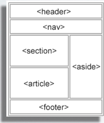

# Mi primer landing page

Genial ahora pondremos en práctica lo que aprendimos de HTML y CSS pero agregaremos un componente nuevo y es bootstrap. imagino que estas pensando que es bootstrap, bueno Boostrap es un framework mobile first desarrollado por la gente de Twitter y liberado a la comunidad; nos permite desarrollar sitios web responsive e interfaces de forma rápida combinando CSS, HTML5 y Jquery, y es eso lo que vamos a realizar ahora.

Como desafío vamos enseñar a construir el siguiente landing page


Ya verás que con bootstrap no es complejo y podremos poner nuestros conocimientos en práctica, asi que manos a la obra!!.

## Iniciando el proyecto

Lo primero que debemos hacer es instalar bootstrap, para esto existen diferentes mecanismos de instalación, pero solo utilizaremos una de ellas, comencemos!

Primero debemos descargar los archivos fuentes de bootstrap. Para ello hacemos click en el siguiente [enlace](https://github.com/twbs/bootstrap/releases/download/v3.3.7/bootstrap-3.3.7-dist.zip) 

El archivo lo deben guardar en alguna carpeta de tu computador. Para esta guía la nombraremos bootstrap_landing. Dentro de la carpeta debemos dejar el fichero comprimido que descargamos, luego lo debemos descomprimir quedando la siguiente estructura de directorios.

```
bootstrap_demo/
├── css/
│   ├── bootstrap.css
│   ├── bootstrap.css.map
│   ├── bootstrap.min.css
│   ├── bootstrap.min.css.map
│   ├── bootstrap-theme.css
│   ├── bootstrap-theme.css.map
│   ├── bootstrap-theme.min.css
│   └── bootstrap-theme.min.css.map
├── js/
│   ├── bootstrap.js
│   └── bootstrap.min.js
└── fonts/
    ├── glyphicons-halflings-regular.eot
    ├── glyphicons-halflings-regular.svg
    ├── glyphicons-halflings-regular.ttf
    ├── glyphicons-halflings-regular.woff
    └── glyphicons-halflings-regular.woff2
``` 

## Configuración template básico

Ahora debemos crear un archivo nuevo que lo nombraremos __index.html__ (puede ser cualquier nombre). 

Debemos abrir el archivo nuevo con nuestro editor de texto sublime text. En el contenido del archivo __index.html__ debemos copiar y pegar el siguiente contenido.

```html
<!DOCTYPE html>
<html lang="en">
  <head>
    <meta charset="utf-8">
    <meta http-equiv="X-UA-Compatible" content="IE=edge">
    <meta name="viewport" content="width=device-width, initial-scale=1">
    <!-- The above 3 meta tags *must* come first in the head; any other head content must come *after* these tags -->
    <title>Landing Page</title>

    <!-- Bootstrap -->
    <link href="css/bootstrap.min.css" rel="stylesheet">

    <!-- HTML5 shim and Respond.js for IE8 support of HTML5 elements and media queries -->
    <!-- WARNING: Respond.js doesn't work if you view the page via file:// -->
    <!--[if lt IE 9]>
      <script src="https://oss.maxcdn.com/html5shiv/3.7.3/html5shiv.min.js"></script>
      <script src="https://oss.maxcdn.com/respond/1.4.2/respond.min.js"></script>
    <![endif]-->
  </head>
  <body>
    <h1>Hello, world!</h1>

    <!-- jQuery (necessary for Bootstrap's JavaScript plugins) -->
    <script src="https://ajax.googleapis.com/ajax/libs/jquery/1.12.4/jquery.min.js"></script>
    <!-- Include all compiled plugins (below), or include individual files as needed -->
    <script src="js/bootstrap.min.js"></script>
  </body>
</html>
```

Este contenido representa **Basic template** de bootstrap y será nuestro punto de partida.

___¿Cómo podemos saber si bootstrap se instaló de forma correcta?___

Entre la etiquetas `<body>`  y `</body>` agregar 

~~~html
<input type="button" value="yeah!!" class="btn btn-primary">
~~~

Si nos aparece lo siguiente


Todo está funcionando. 

## Definiendo las secciones de nuestro landing

Para construir nuestro landing lo primero que debemos es mirar nuestro diseño y segmentarlo en los diferentes bloques que estan propuestos, para definir cada bloque utilizaremos de forma correcta las etiquetas de HTML5 como header, footer, aside y section. 



Si quieres saber más de esto revisa el siguiente [link](http://www.w3schools.com/html/html5_semantic_elements.asp).


Lo que se presenta en la foto anterio lo debemos llevar código, para ello escribiremos los siguientes bloques dentro de la etiqueta body. (recuerda que todo lo que ve el visitante de tu sitio va dentro de body)

El esqueleto de nuestro landing lo definiremos de la siguiente forma

```html
  <header>

  </header>

  <section class="block">
    
  </section>

  <section class="block alt">
    
  </section>

  <section class="block info">
    
  </section>

  <footer>
    
  </footer>

```

Si te fijas se etiquetó las secciones con algunas clases, esto lo veremos más adelante pero será de mucha utilidad para aplicar nuestras reglas de css.

Dentro de cada bloque colocaremos lo siguiente

```html
<div class="container">
    <div class="row">
      
    </div>
  </div>
```

Este bloque define un contenedor de un ancho que bootstrap proporciona y cambia en función del tamaño de nuestro viewport*. Con el bloque row nos permitirá colocar columnas de forma segura sin que se desarme nuestro diseño. Si quieres saber más detalles como funciona la clase .row visita el siguiente [link](http://librosweb.es/libro/bootstrap_3/capitulo_2/reseteando_columnas.html) que se explica en detalle el concepto de clearfix & row.

Ahora podemos ir definiendo las diferentes columnas en función de layout que estamos intentando construir.

Comencemos con el header. Si revisas la imagen te darás cuenta que el header contiene una imagen de fondo, una frase principal (nuestro h1), dos botones, una frase de bajada (un párrafo `<p>`) y un menú. Para este último utilizaremos [navbar de bootstrap](http://getbootstrap.com/components/#navbar). Ahora todos estos elementos en el header deberían quedar de la siguiente forma.

```html

  <header class="main">

      <div class="container">
          <div class="row">
              <div class="col-md-12">
                  <nav class="navbar navbar-default navbar-latam">
                    <div class="container-fluid">
                      <!-- Brand and toggle get grouped for better mobile display -->
                      <div class="navbar-header">
                        <button type="button" class="navbar-toggle collapsed" data-toggle="collapse" data-target="#menu" aria-expanded="false">
                          <span class="sr-only">Toggle navigation</span>
                          <span class="icon-bar"></span>
                          <span class="icon-bar"></span>
                          <span class="icon-bar"></span>
                          
                        </button>
                        <a class="navbar-brand" href="#">
                            
                        </a>
                      </div>

                      <!-- Collect the nav links, forms, and other content for toggling -->
                      <div class="collapse navbar-collapse" id="menu">

       
                        <ul class="nav navbar-nav navbar-right">
                          <li><a href="#">Equipo</a></li>
                          <li><a href="#">Blog</a></li>
                          <li><a href="#">Contacto</a></li>

                        </ul>
                      </div><!-- /.navbar-collapse -->
                    </div><!-- /.container-fluid -->
                  </nav>
              </div>
          </div>
          <div class="row">
              <div class="col-md-8 col-md-offset-2">
                <h1 class="headline text-center">Comienza una nueva vida y únete al mundo tecnológico</h1>
                <p class="text-center">
                    <button class="btn btn-primary btn-lg">Comienza Acá</button>
                    <button class="btn btn-success btn-lg">Más info!</button>
                </p>   

                <p class="text-center headline-caption">Hay una escasez gigante de desarrolladores en el mundo y más aún en Latinoamérica, se necesitan más desarrolladores y Tú puedes ser uno!</p>
              </div>
          </div>
      </div>
  </header>

```

Al colocar este código ya podrías ver en tu navegador como va quedando el landing. si te fijas lo que vemos es solo estructural, asi que tranquila ya le pondremos color :D.

Hablemos de este código que acabamos de pegar.

El elemento más complejo de **este bloque** es el menú (o navbar). Bootstrap nos provee un menú ya construido y solo debemos copiar y pegar (si como lo escuhas copiar y pegar pero con un poco de talento :D).

El menú por si solo está definido en el siguiente bloque:

```html
<nav class="navbar navbar-default navbar-latam">
                    <div class="container-fluid">
                      <!-- Brand and toggle get grouped for better mobile display -->
                      <div class="navbar-header">
                        <button type="button" class="navbar-toggle collapsed" data-toggle="collapse" data-target="#menu" aria-expanded="false">
                          <span class="sr-only">Toggle navigation</span>
                          <span class="icon-bar"></span>
                          <span class="icon-bar"></span>
                          <span class="icon-bar"></span>
                          
                        </button>
                        <a class="navbar-brand" href="#">
                            
                        </a>
                      </div>

                      <!-- Collect the nav links, forms, and other content for toggling -->
                      <div class="collapse navbar-collapse" id="menu">

       
                        <ul class="nav navbar-nav navbar-right">
                          <li><a href="#">Equipo</a></li>
                          <li><a href="#">Blog</a></li>
                          <li><a href="#">Contacto</a></li>

                        </ul>
                      </div><!-- /.navbar-collapse -->
                    </div><!-- /.container-fluid -->
                  </nav>
```
*Recuerda que esto ya está en el código que pegamos anteriormente, no es necesario que lo vuelvas a copiar/pegar*

Si todo funciona correctamente, ya deberíamos tener nuestra página con un menú que funciona en pantallas pequeñas. 

__¿Y el logo donde fue que lo colocamos?__

Navbar ya nos provee con un pequeño bloque para colocar nuestro bloque. Acá colocaremos el logotipo de nuestro diseño. Este bloque debería quedar así

```html
<a class="navbar-brand" href="#">
    
</a>
```

¿Funciona la imagen? la respuesta es no :/. esto se debe a que debemos cargar la imagen en nuestro proyecto. Para ello crearemos una carpeta al mismo nivel que css, y le colocaremos el nombre de __images__ dentro de ella copiamos la imagen del logo (la puedes descargar desde [acá](demo/images/latam_logo.png))

Si te fijas y vuelves a abrir la página ya verás el logo (no se verá del todo bien pero ya lo mejoraremos :D)

Sigamos con las siguientes secciones. Ahora enfoquemonos en la siguiente sección. La siguiente sección tenemos menos elementos y es más simple. Acá tenemos un título de menor jerarquia (lo definiremos como `<h3>`), un texto y una imagen. 

```html

  <section class="block">
    <div class="container">
      <div class="row">
        <div class="col-md-12">
          <h3 class="text-center">Lorem ipsum dolor sit amet, consectetur adipisicing elit</h3>
          <p class="text-center">Lorem ipsum dolor sit amet, consectetur adipisicing elit. Nesciunt, qui, necessitatibus. Perferendis pariatur quae, vero, voluptate saepe soluta itaque rerum earum sit alias harum repudiandae eos molestias magnam iusto, voluptatibus.</p>

          <p class="text-center">
            
          </p>
        
        </div>

      </div>
    </div>
  </section>

```
*Ojo que ya habíamos colocado dentro de la* `<section>` esto:

~~~html
<div class="container">
    <div class="row">
      
    </div>
  </div>
~~~  
*Por lo que si copias todo, pégalo sobre eso.*


Si te fijas bien estoy definiendo columnas de 12, si bien no es necesario, lo definiremos para ser consistentes con el uso de columnas.

Probemos lo que llevamos ahora. Recuerda que solo estamos definiendo elementos estructurales (para eso es HTML)

Sigamos con la siguiente sección

Acá nuevamente tenemos un título de menor jerarquia (lo definiremos como `<h3>`), un texto, pero tenemos algo nuevo , un botón!
Para éste utilizamos una etiqueta nueva llamada `<button>`(botón en inglés)
y le agregamos las clases de botón que usa bootstrap.

~~~html
<div class="container">
      <div class="row">
        <div class="col-md-12">
          <h3 class="text-center">Lorem ipsum dolor sit amet</h3>
          <p class="text-center">Lorem ipsum dolor sit amet, consectetur adipisicing elit. Dolorem possimus delectus, tempore ducimus aliquam quam cum, asperiores maxime earum error hic atque omnis voluptates. Consectetur dolor aut voluptas libero ea.</p>
          <p class="text-center">
            <button class="btn btn-primary">Inscribete!</button>
          </p>
        </div>
      </div>
</div>
~~~

Si te fijas, el botón se dejó dentro de un párrafo para darle la propiedad de alineamiento centrado (`class="text-center"`)


Uff! ya estamos casi. nos queda la última sección. A diferencia de las anteriores esta la dividiremos en dos columnas. la primera será de 4 columnas y la segunda 8 para completar las 12 columnas que necesitamos. Por lo que nos quedaría de la siguiente forma:

```html
  <section class="block info">
    <div class="container">
      <div class="row">
        <div class="col-md-4">
          
        </div>
        <div class="col-md-8">
    
        </div>
      </div>
    </div>
  </section>
```

En la columna de 4 colocaremos nuestra dirección de la siguiente forma:

```html
<h3>Contacto</h3>
  <address>
    <strong>Twitter, Inc.</strong><br>
    1355 Market Street, Suite 900<br>
    San Francisco, CA 94103<br>
    <abbr title="Phone">P:</abbr> (123) 456-7890
  </address>
```

Estamos usando la etiqueta address que nos permite indicarle a los motores que ese bloque corresponde a una dirección.

Ahora en la columna de 8, colocaremos el formulario

```html
 <h3>Suscribete</h3>
          <form class="form-inline">
         
            <div class="form-group">
              
              <input type="email" class="form-control" id="exampleInputEmail2" placeholder="jane.doe@example.com">
            </div>
            <button type="submit" class="btn btn-default">Send invitation</button>
          </form>
```
Para el formulario estamos usando los elementos de bootstrap que hace que nuestros form queden cool! si quieres saber más revisa la documentación de [boostrap referente a los formularios](http://getbootstrap.com/css/#forms)

El bloque completo quedaría de la siguiente forma

```html
 <section class="block info">
    <div class="container">
      <div class="row">
        <div class="col-md-4">
          <h3>Contacto</h3>
          <address>
            <strong>Twitter, Inc.</strong><br>
            1355 Market Street, Suite 900<br>
            San Francisco, CA 94103<br>
            <abbr title="Phone">P:</abbr> (123) 456-7890
          </address>
        </div>
        <div class="col-md-8">
          <h3>Suscribete</h3>
          <form class="form-inline">
         
            <div class="form-group">
              
              <input type="email" class="form-control" id="exampleInputEmail2" placeholder="jane.doe@example.com">
            </div>
            <button type="submit" class="btn btn-default">Send invitation</button>
          </form>
        </div>
      </div>
    </div>
  </section>
```

Finalmente nos queda definir el pie de la página. Esto será simple y se reduce a lo siguiente

```html
  <footer>
    <div class="container">
      <div class="row">
        <div class="col-md-12">
          <p>Hackgirls 2016 / Frontend Day.</p>
        </div>
      </div>
    </div>
  </footer>
```

Con esto ya tenemos nuestro código base para comenzar a pintar. Te perdiste? no te preocupes [acá](images/demos/index.html) puedes revisar el código completo. 

## Colocando un poco de color (CSS)

### Sección header

Lo primero que debemos hacer es linkear nuestra hoja de estilo con el html que estamos construyendo. Para ello vamos a crear un archivo vacío dentro de la carpeta css y lo nombraremos como ***style.css***
El segundo paso es vincularlo con nuestro html, para ello colocaremos el siguiente código en nuestra cabecera

```html
<head>
 ...
  <link rel="stylesheet" href="css/style.css">
 
</head>>
```

Muy importante respetar donde crear los archivos, ya que si cambias la ubicación, nuestro html no lo podrá encontrar.

Una vez vinculada la página, comenzaremos aplicando las reglas generale a nuestro documento.

Lo primero que vamos a realizar es definir la tipografía que usaremos y el tamaño de fuente para párrafos para todo el documento

```css
body,html {
  font-size: 16px;
  font-family: 'Open Sans', sans-serif;
}
```

Para poder usar Open Sans debemos cargar esta fuente en nuestra cabecera del documento HTML. (si quieres saber más sobre tipografías te recomiendo este [link](#))

```html
<head>
 ...
 <link href="https://fonts.googleapis.com/css?family=Open+Sans" rel="stylesheet">
 ...
  <link rel="stylesheet" href="css/style.css">
 
</head>>
```

Si refrescas la página notarás un pequeño cambio en las tipografías.

Sigamos! lo segundo que vamos a realizar es agregar algunas cosas en nuestro bloque header (lo recuerdas?)

Lo primero es lo primero, el fondo del bloque!! esto lo hacemos a través de css utilizando la propiedad background, luego background-size para que nos quede cool y logremos que la foto se adapte a la pantalla.

```css
.main {
  background: url('../images/bg22.jpeg') no-repeat ;
  background-size: cover; 

  padding-bottom: 50px;

  /* height: 100vh ; */
}
```

Y que es esto padding-bottom:50px? es un margen inferior. y esto /* height: 100vh ; */ eso es un comentario por lo que no śe considera al momento de renderizar la página.

Ahora trabajemos con nuestro título principal (el h1 lo recuerdas?), este título le agregamos una clase llamada headline, ahora la forma correcta de referenciar ésto sería de la siguiente forma

```css
.main .headline {
...
}
```

Dentro de este bloque definiremos, tipografía, sombras, tamaño, peso de la tipografía y utilizaremos la tipografía lato. El bloque debería lucir de la siguiente forma

```css
.main .headline {
  color: #FFFFFF;
  font-family: 'Lato', cursive;
  text-transform: uppercase;
  font-weight: bold;
  font-size: 2.4rem;
  margin-bottom: 1.8rem;
  text-shadow: 0px 0px 24px rgba(0, 0, 0, 0.98);
}
```

Recuerda que para usar lato debes agregar el siguiente código en tu head

```html
<link href="https://fonts.googleapis.com/css?family=Lato" rel="stylesheet">
```

Con esto ya verás el título con la tipografía Lato y los estilos que ya aplicamos. Ahora retocaremos el texto de bajada que etiquetamos con la clase __.headline-caption__, a esta clase aplicaremos tamaños de medidas y sombra, además definiremos el color de fuente a blanco. Las reglas CSS serán

```css
.main .headline-caption {
  color: #FFF;
  font-size: 0.9rem;
  margin-top: 1.8px;
  text-shadow: 0px 0px 24px rgba(0, 0, 0, 0.98);
}
```

Ahora nos toca la última tarea de la sección header y es retocar el menú. El menú que estamos utilizando, es provisto por bootstrap y provee la funcionalidad responsive, lo que hace que sea muy cool! pero tenemos que adaptarlo a nuestro landing, para ello agregaremos la clase navbar-latam al bloque principal (esto ya lo realizamos cuando construimos el HTML, no lo recuerdas? revisa la sección header del bloque html). Con la clase navbar-latam vamos a sacar el fondo y el borde que tiene el navbar, con ello bastaría para que se acople a nuestro diseño. las reglas que debemos aplicar son las siguientes.

```css
.main .navbar-latam {
  background-color: transparent;
  border-color: transparent;
}
```

Finalmente un pequeño ajuste al logo para que se adapte al tamaño de la pantalla y no crezca más de 150px. (revisa la imagen, es gigante :|)

```css
.main .navbar-brand .logo {
  max-width: 150px;
}
```

Con esto ya tenemos listo el header. Tomemos un descanzo y seguimos con las otras secciones.

### Secciones de contenido

Sigamos!! ya nos queda muy poco para terminar. Lo siguiente que vamos a realizar es la primera sección de nuestro sitio. Esta sección estaba clasificada por clase .block. Dentro de esta sección tenemos un título, parrafo y una imagen (que está clasificada con la clase .people).

Para el título vamos a convertirlo en mayusculo y dejarlo en  negritas, esto se hace con

```css
.block h3 {
  text-transform: uppercase;
  font-weight: bold;
}
```

A la imágen de los niños, vamos a definir un ancho máximo y un margen de -10px para que podamos ajustar la posición con respecto al término del bloque, dejando las reglas definidas de la siguiente forma:

```css
.block .people {
  max-width: 400px;
  margin-bottom: -10px;
}
```

Acá debemos destacar dos cosas, la primera es que la clase block la ocupamos en el resto de las secciones, esto lo genial de las clases y es que se pueden reutilizar, asi que con estas reglas se aplicarán a todos los bloques posteriores y no tendremos que ir colocando bloque a bloque!

Ahora en la siguiente sección, a diferencia de la anterior, el color de fondo es de tono gris. Hay varias formas de solucionar esto, acá te mostraremos una de ellas. Si te fijas en el HTML, este bloque agregamos un clase adicional a block con el nombre alt, gracias a esto podemos seleccionar el block que contenga la clase alt de la siguiente forma

```css
.block.alt {
  background: #EEE;
  padding-top: 30px;
  padding-bottom: 30px;
  border-top: 1px solid #CCC;
  border-bottom: 1px solid #CCC;
}
```
Con estas reglas, definimos un fondo gris, margenes interiores al bloque y un border solido de color gris en la parte superior e inferior del bloque. Guarda y refresca la página y verás como queda!

Ahora nos quedaría el último bloque, al igual que el anterior, se etiqueto con la clase info. Acá solamente queremos hacer cambiar a los títulos que tienen los bloques. Si te fijas todos los bloques que tienen la clase .block y que contengan un h3 aplicarán las reglas que definimos con anterioridad, pero si quieremos reescribir alguna de ellas, podremos ser más especifico de la siguiente forma

```css
.block.info h3 {
  font-size: 1.2rem;
  text-transform: capitalize;
  font-weight: bold;
}
```
Acá solo estamos creando una regla más especifica que sobre-escribirá aquellas reglas que ya estén definidas con anterioridad. Listo! terminamos con los bloques, solo nos queda el footer!

### Sección footer

Hemos llegado al final, asi que alegrate!! el footer es simple y solo cuenta con un parrafo que debemos ajustar algunas cosas de tamaño, color y espaciado, asi que aquí vamos.

Lo primero es colocar el color de fondo al footer que será #383838, esto lo hacemos de la siguiente forma

```css
footer {
  background: #383838;
}
```
Ahora nos falta aplicar las reglas al parrafo que está dentro de la etiqueta footer, esto lo hacemos de la siguiente forma

```css
footer p {
  color: #FFF;
  height: 30px;
  letter-spacing: 0.2rem;
  font-weight: bold;
  font-size: 1.1rem;
  text-transform: uppercase;
  line-height: 40px;
}
```
Acá hacemos varias cosas y las detallo. Primero dejamos el color de la fuente en blanco, el alto del bloque lo definimos en 30px, el espaciado entre cada letra lo dejamos en 0.2rem, dejamos la fuente en bold, definimos el tamaño de fuente en 1.1rem y dejamos todo en mayuscula a través de text-transform y finalmente el interlineado será de 40px, este último paso podría ser un truco para centrar el contenido de forma vertical. Pruebalo y revisa como se ve en tu navegador!

## Desafío extra con Bootswatch

Pensaste que era todo? nos falta la guinda de la torta. Bootstrap nos provee algunos temas que definen los elementos bases que ya estamos utilizando en nuestro proyecto, como los botones, menús, entre otros. Para ello utilizaremos [Bootswatch](https://bootswatch.com/) que nos entrega varias alternativas. Revisa la que más te guste, descarga el archivo bootstrap.css y reemplazalo por el que ya tienes en tu carpeta css (si no quieres perder los estilos bases, realiza una copia antes de reemplazar el archivo). Al reemplazar los estilos, verás como nuestro landing tomará otra personalidad!


Saludos!